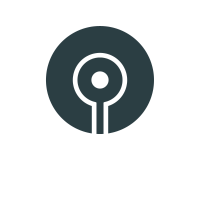

# Prochains évènements

## Festival de la Terre ateliers gratuits

**<i class="fa fa-calendar"></i> Les 10, 11 et 12 juin**, aura lieu le Festival de la Terre à Lausanne! J’y animerai 2 ateliers gratuits d’introduction à l’autohypnose dans le "Dôme 2" :

- Autohypnose *"confiance en soi"* vendredi 10 juin de 16h à 17h
- Autohypnose *"augmentez votre plaisir sexuel"* samedi 11 juin de 13h à 14h

Vous pourrez également me retrouver sur mon stand durant les 3 jours du festival et y découvrir des séances d'hypnose et de soins énergétiques de 30min et y passer de beaux moments de partages. :-)

{: .align-center .margin-top-50 }
Suivez mon actualité sur
[ma page Facebook <i style="font-size:30pt;" class="fa fa-facebook-official"></i>]({{ site.data.infos.facebook.fb-url }})

{: .align-center }
{: height="90" width="90" }


